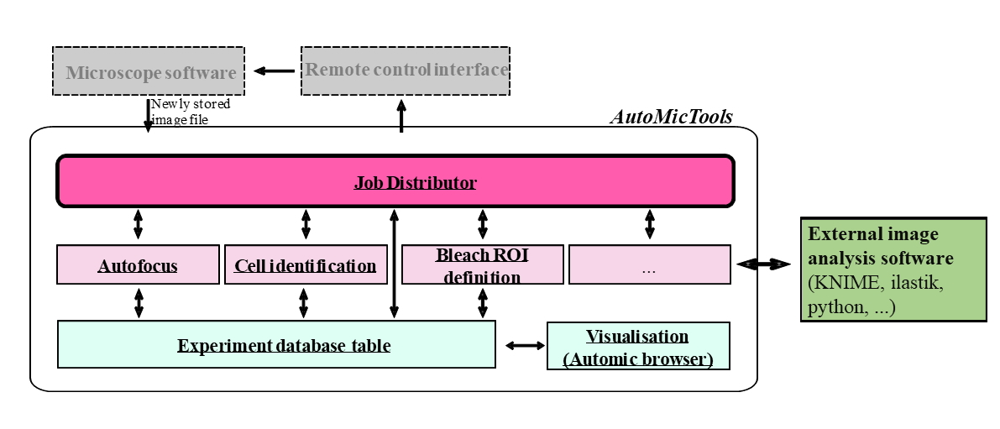

#  Modular adaptive feedback microscopy workflows with AutoMicTools
**Aliaksandr Halavatyi, Manuel Gunkel, Rainer Pepperkok**, Advanced Light Microscopy Facility (ALMF), European Molecular Biology Laboratory (EMBL), Heidelberg Germany

## Specific Focus and scientific questions asked
Adaptive Feedback Microscopy is used to automate and run different kinds of microscopy experiments with integrated image analysis in a high throughput manner for example detection and high-resolution imaging of certain phenotypes or different kinds of photomanipulation experiments. Applying this methodology for various kinds of experiments often requires dedicated hardware. Many systems, for example confocal laser scanning microscopes (cLSMs), are controlled by vendor proprietary software. Therefore, microscope companies need to design dedicated modules for their softwares for running smart microscopy workflows. If different image analysis and workflow management tools are used on different microscope types to automate them, microscopy facilities and other research infrastructures operating microscopes of different brands need to support many additional software tools to benefit from available hardware. Migration of workflows implemented on different microscopes becomes hardly possible, even if needed imaging modalities are available.
To overcome these limitations, we established a toolbox called *AutoMicTools* which enables setting up, testing and running adaptive feedback microscopy workflows on several advanced systems. The implemented workflows consist of multiple interacting modules to separate image analysis routines and logics for communicating to the microscope.

:::{div} figure-like



**Fig. 1:** Structure of *AutoMicTools* workflow and its interaction with external software tools.

:::

## Key findings and innovations 
Several workflows have been designed with *AutoMicTools* toolbox and run on different confocal microscopes in our facility:

**High resolution multicolour volumetric imaging of classified phenotypes and rare events.**
Several versions of this workflow have been established in the context of cell biology and developmental biology studies. For example, live cell cultures {cite:p}`Kletter2024`, {cite:p}`Brunner2025`, have been imaged to identify and image cells in a particular stage of a cell cycle for a time period up to 72 hours. A screen of drosophila stained lines has been performed to collect high resolution data of gene expression patterns in those samples {cite:p}`Fuqua2020`{cite:p}`Fuqua2021`.
All projects have benefitted from the possibility to extend the workflows by integrating multiple image acquisition and analysis steps on demand. For example, an additional round of focusing has been implemented to estimate axial positions of individual cells or embryos after identifying them in 2D and automatically adjust high resolution imaging volume.

**Automated photomanipulation.**
1) Fluorescence Recovery After Photobleaching (FRAP) experiments have been run automatically to measure turnover of COPII proteins at ER-exit sites (ERES). More than 500 recovery curves have been collected in each imaging session (~16 hours long), allowing to study distributions of recovery rates and correlate them with other measured parameters of target cells.

2) Automated photo-activation has been set to enable researchers to automatically identify, fluorescently mark, sort and sequence single cells or cell populations carrying target phenotypes. The workflow has been initially established in the framework of a project aiming to study networks regulating Golgi structure {cite:p}`Singh2022`. Cells under well-defined gene knock-down conditions show heterogeneous Golgi morphology phenotypes suggesting that the different phenotypes are due to different molecular stages the cells are in. In order to address this question, it has been necessary to directly correlate the Golgi morphology phenotype with the molecular stage of the cells. The originally established protocol has been used for studying other biological phenomena by plugging in project-specific image analysis modules identifying target cells {cite:p}`Cosenza2024`.


## Methodology and implementation details
A core microscope-agnostic part of the workflow is implemented as the *AutoMicTools* library for ImageJ/Fiji containing multiple plugins. Several imaging and photomanipulation workflows are available in *AutoMicTools* as ready-to-use plugins, new workflows can be created by subclassing provided Job and JobDistributor classes using Java programming or Fiji scripting tools (Fig. 1):

**Job:** An *AutoMicTools* Job needs to be defined for each particular image analysis task. It combines functions for image analysis itself, pre- and post-processing, on-the-fly visualisation of analysis results and creating feedback commands in a microscope-agnostic manner. Project-specific analysis Jobs can be created by subclassing the Job_default base class using Java programming or Jython Scripting using provided examples as templates. Alternatively, predefined jobs accepting user-defined image analysis macros or scripts as parameters can be used. Jobs can be modified to to bridge to external applications for running image analysis (e.g. Python, Ilastik or KNIME).

**JobDistributor:** The JobDistributor module is responsible for monitoring a defined folder for the arrival of new files and - based on their name tags - executing predefined image processing tasks defined by the Job classes. An individual JobDistributor with an arbitrary number of Jobs has to be configured for each workflow by mapping the names of the image file tags to Analysis Jobs to be executed. 

## Contributions to Interoperability
*AutoMicTools* Fiji plugins allow to set up and debug microscope-agnostic parts of the workflow. The workflow can be simulated without access to the microscope when example images for different imaging jobs are available. The same core workflow can be run on different microscopes by using brand-specific communication tools, implemented using corresponding API layers:

**Zeiss ZenBlue:** We set up multiple *AutoMicTools*-based imaging and photomanipulation feedback microscopy workflows using Zeiss confocal microscopes, in particular LSM900 and LSM980, controlled by ZenBlue. For that we make use of the ZenBlue macro programming environment which is part of the Open Application Development (OAD) package. Established macros control acquisition loop, reuse and trigger a priori defined imaging settings based on the feedback received from image analysis [[code repo](https://git.embl.de/grp-almf/zeiss_zenblue_automation/)].

**Zeiss ZenBlack:** Multiple of the above mentioned workflows we also run on the previous generation of Zeiss confocals (LSM780/880). Macro programming in this software is only possible with Visual Basic (VB), which is not commonly used these days. To link *AutoMicTools* to ZenBlack, we make use of the MyPic macro developed by Antonio Politi in the Ellenberg lab [current repository](https://github.com/manerotoni/mypic/) {cite:p}`Politi2018`. MyPic has a friendly GUI to keep track of multiple acquisition/photomanipulation settings, and to define default positions; it is capable to receive a feedback from an external application (e.g. *AutoMicTools*) with computed imaging positions of photomanipulation ROIS via the Windows registry.

**Evident(Olympus) FluoView:** Software driving FluoView3000 and FluoView 4000 point scanning confocal microscopes, is equipped with an RDK module, which allows to change acquisition parameters and control some of the hardware components (e.g. stage, focus drive and objective turret) by sending XML-formatted commands from different programing languages. We have developed a Fiji plugin which makes use of this functionality and controls Acquisition settings and sample positions in [*AutoMicTools* workflows](https://git.embl.de/grp-almf/automictools-fluoview-bridge). Settings for each imaging job on the microscope are provided from a configuration file.

**Nikon NIS Elements:** The Nikon software NIS-Elements provides also a macro environment. We have written a set of macros which, when executed, wait for a specific text file containing information which experiment to run. ROIs are transferred as binary tif files via the NikonCommander in automic tools. The workflow is controlled by an additional [jython script](https://git.embl.de/grp-almf/automictools-nikon-bridge).
Leica LMD (Leica Laser Microdissection 7)
An image produced by the LMD system (in *.bmp format) is analysed and stored in a new path. The resulting ROIs are stored in an xml file that can be parsed by the microscope software. For synchronization a small executable is needed which is called by the LMD software and closed by automic tools. The close of the exe triggers the LMD to proceed with the next position [[code repo](https://git.embl.de/grp-almf/automictools-leicalmd)].

## Limitations
Although the implemented schema has a lot of flexibility for customising and extending the workflows for project-specific needs, it has several restrictions linked to the limitations of APIs that are provided by vendors for their proprietary software. Different APIs support different functionalities, which makes generalization challenging. For example, the transfer of image data from acquisition software to our Fiji plugins currently requires saving image files, as in majority of use cases API to transfer image data in memory is currently not available. This aspect can be important for time critical applications, such as tracking of fast live samples by moving the acquisition field-of-view. Likewise, certain essential features, such as specifying arbitrary shapes of photomanipulaiton ROIs, rotation of the field of view, changing scanning area for LSM systems and changing the z-stack height, are not available for many vendor APIs:
We collaborate with our industry partners in several formats, including Smart Microscopy Working Group, to enhance the power of provided APIs, that will contribute to flexibility of *AutoMicTools* and other packages making use of them for microscope automation.

----

```{bibliography}
:style: plain
:filter: docname in docnames
```
