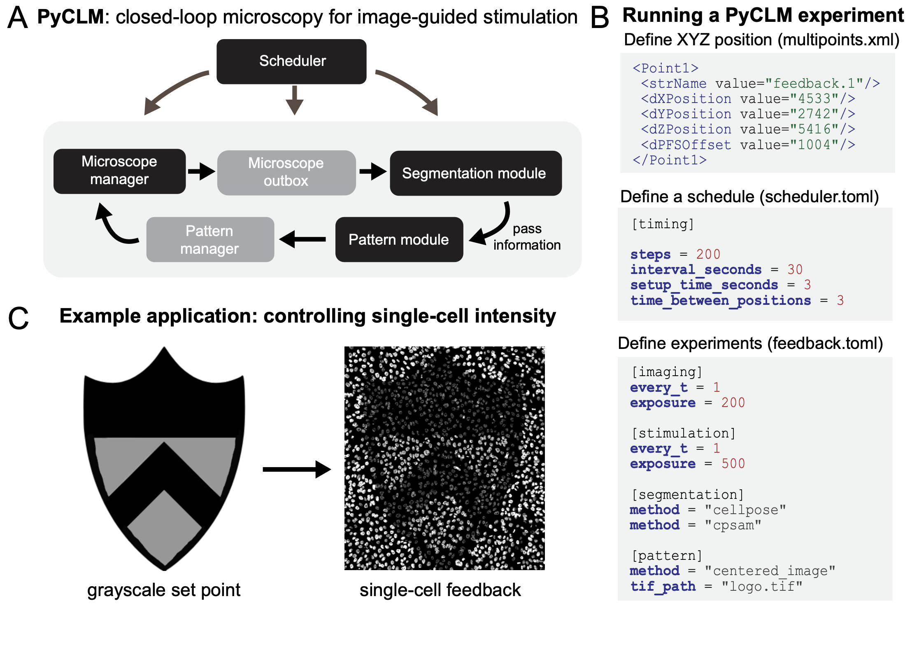

#  PyCLM: programming-free, closed-loop microscopy for optogenetic stimulation
**Harrison Oatman [1], Jared Toettcher [2,3]**  
[1] Lewis Sigler Institute, Princeton University  
[2] Department of Molecular Biology, Princeton University  
[3] Omenn-Darling Bioengineering Institute, Princeton University  


## Specific Focus and scientific questions asked
How is cell signaling coordinated across entire macroscopic tissues comprising thousands of cells or more? This question cannot be answered without considering biology occurring at vastly different scales, from the minutes-timescale signaling states of individual cells to collective properties such as local cell density, tissue jamming, and diffusion-mediated ligand gradients across entire tissue regions. Receptor tyrosine kinases (RTKs) are at the center of many tissue-scale signaling processes in developing embryos and regenerating tissues. For example, waves of extracellular signal-related kinase (ERK) activity propagate for millimeters to centimeters across vertebrate tissues in a wide range of contexts, where they are thought to orchestrate collective properties of the tissue such as its density and directional migration.
The study of tissue-scale signaling is enabled by two optical technologies: **live-cell biosensors** of cell signaling to report on the current activity state of all cells, and **optogenetic tools** to perturb signaling dynamics to better understand their specific functions. Many biosensors and optogenetic tools have been developed for studying receptor tyrosine kinase signaling at different nodes {cite:p}`Regot2014,Kim2014,Dine2018,Farahani2023,Toettcher2013`. We may now ask a set of questions to (1) better understand the function of endogenous RTK dynamics and (2) deliver appropriate light inputs to control RTK dynamics and alter functional outcomes at the tissue scale (e.g. migration, cell density, regenerative phenotypes). Some of these questions include the following:
-	How do traveling waves of RTK activity affect tissue-scale movement?
-	How do specific dynamic properties (e.g. wave speed, spatial frequency) contribute to the outcome?
-	Can we combine real-time measurement of cellular position with dynamic control of RTK stimulation to guide tissue flows?
Answering any of these questions requires the ability to deliver dynamic light inputs that vary both over time and in space to large numbers of cells. For the final question, one further capability is required: the ability to automatically update light inputs to hundreds or thousands of cells based on real-time measurements of cells’ current positions, a procedure that might be termed ‘closed-loop microscopy’ and which would constitute a subset of smart microscopy applications.
Our PyCLM software package addresses all of the aforementioned challenges by providing a framework for imaging cells, segmenting them in real-time, and delivering optogenetic stimuli. We were motivated by an important design criterion: it should be as easy as possible to set up experiments that combine any set of previously-defined imaging, segmentation, and stimulation procedures. Ideally, the end user (a new student in the lab, or a collaborator) should be able to combine any set of previous workflows without writing any new code at all.

## Key findings and innovations 
We used PyCLM to stimulate tissues of MCF10A breast epithelial cells with traveling waves of RTK activity. Indeed, we found that waves are sufficient to induce tissue translation: collective movement of cells in the direction of the wave. Wave speed played an important role in the migration response, with slow waves (~1-10 μm/hr) driving slow migration, intermediate wave speeds (~10-25 μm/hr) achieving optimal migration, and fast waves (>25 μm/hr) failing to induce tissue translation at all, instead producing small oscillations in cell position.
We also explored other use cases of closed-loop microscopy, including using real-time cell segmentation to identify single cells in an MCF10A epithelial tissue, and then stimulating each cell to produce counterclockwise rotational tissue flows. Finally, we implemented an experimental workflow for single-cell feedback control of fluorescent intensity. In this workflow, cells are automatically segmented and their fluorescent intensity measured, and a bang-bang controller is used to apply light inputs to drive each cell to a desired fluorescent set point.

## Methodology and implementation details
PyCLM integrates excellent tools that are already available for subsets of the closed-loop microscopy workflow. Microscope hardware control is provided by pymmcore-plus v0.13.7 and Micromanager  {cite:p}`Edelstein2010` v2.03, whereas automated cell segmentation is implemented using Cellpose13 v4.0.6. All code and software requirements are available on the [project's Github page](https://github.com/Harrison-Oatman/PyCLM). Pymmcore-plus is available [on Github](https://github.com/pymmcore-plus) as well.
PyCLM is organized as a set of modules that pass information in a loop (Fig. 1A). A master scheduler ensures that each position is imaged and stimulated at the desired frequency, a microscope manager controls hardware through Micromanager, a segmentation module performs image segmentation using Cellpose, and a pattern module defines the next optogenetic stimulation pattern, which may vary depending on the outcomes of imaging and segmentation. These modules run as separate threads to maximize the number of experiments which can be run simultaneously.
PyCLM can run multiple experiments simultaneously, with a simple schema for specifying the details of these experiments. The user chooses positions, sets an imaging schedule, and determines which experiments will be run by adding configuration files to a directory (Fig. 1B). The first step is to define a set of multipoint XYZ stage positions at which to carry out the imaging and stimulation experiments. These can be chosen interactively in MicroManager or proprietary imaging programs (e.g. NIS Elements) and conveniently exported. Assign a name to each position to identify the experiment associated with it. For example, a set of positions named “feedback.1”, “circle125.1”, and “circle125.2” will perform a feedback control experiment on one position (Fig. 1C) and stimulate with a 125 μm circular light pattern on the other two positions. Next, experiment configuration files in a Toms Obvious Minimal Language (.TOML) format specify the imaging conditions and stimulation parameters for an experiment. These files can be reused and modified or built from scratch using human-readable language. Finally, a master schedule is supplied in scheduler.toml to determine the timing of the experiments. Configuration files for currently implemented experiments (e.g. feedback.toml; circle125.toml) are provided alongside the software. Once directory setup is complete, PyCLM performs the experiment and continuously saves the results to the same location. 

## Contributions to Interoperability
PyCLM was written with interoperability in front of mind. The package is written to be agnostic of underlying microscope hardware provided that a stage (for multipoint imaging), camera (for image acquisition), and digital micromirror device (for optogenetic stimulation) are present. PyCLM is compatible with any MicroManager-defined channels and configuration groups. The output of PyCLM experiments is packaged as Hierarchical Data Format 5 (HDF5) files, an open-source file format that can be processed using a variety of downstream software tools, and allows for detailed export of experiment metadata.

## Limitations
Our lab is actively using PyCLM for an increasing number of experiments, and new workflows are under construction. Nevertheless, it is still the case that a relatively small set of experimental workflows have been implemented to date, mostly focused on constant and wave-based illumination and intensity-based feedback control. Also, while our software should be interoperable with other Micromanager-controlled microscopes, it has so far been used only on a single hardware system. Finally, while we have implemented cell segmentation, the current version of PyCLM does not support single-cell tracking over time. This restricts PyCLM to using feedback controllers that only require current, instantaneous information about cell states (e.g. current intensity). Adding support for single-cell tracking and memory of prior states is a top priority for future versions.

:::{div} figure-like



**Figure 1. Closed-loop microscopy using PyCLM.** **(A)** Schematic of the code organization. PyCLM is written as a series of modules that pass information in a loop. A microscope manager controls the underlying imaging and stimulation hardware, a microscope outbox collects the resulting imaging data, a segmentation module performs image segmentation, a pattern module uses the segmentation and imaging results to define a new optogenetic stimulation pattern, and a pattern manager stores the patterns and sends them at the appropriate time to the microscope manager. **(B)** Designing a PyCLM experiment is performed using a series of configuration files. A multipoints.xml file stores information about the experiment to run at each stage position, and a scheduler.toml file specifies the overall parameters of the imaging/stimulation sequence. Each individual experimental workflow is specified in a corresponding .toml file, which defines the imaging configurations, segmentation methods, and stimulation pattern module to be run. **(C)** PyCLM enables many experimental workflows including constant and dynamic light patterns, real-time optogenetic stimulation of migrating cells, and feedback control of fluorescence intensity, shown here for MCF10A cells expressing the TagRFP photochromic protein.
:::

----

```{bibliography}
:style: plain
:filter: docname in docnames
```
