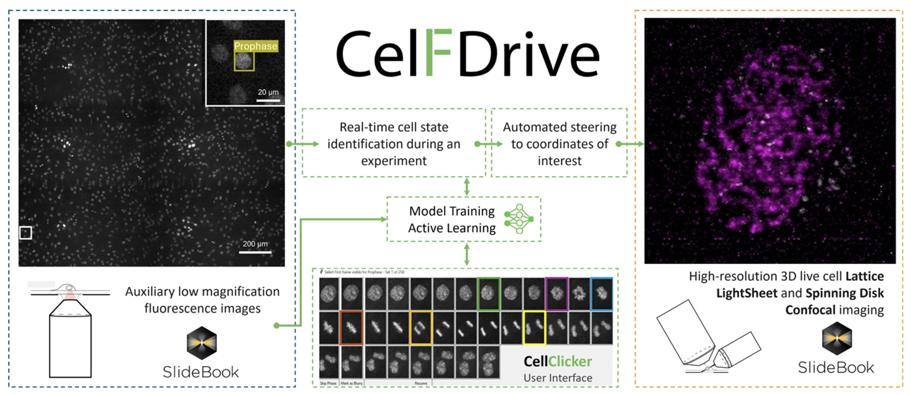

#  CelFDrive: Multimodal AI-Assisted Microscopy for Detection of Rare Events
Scott Brooks [1,2]
Sara Toral-Pérez [1,2], 
David S. Corcoran [1,2], 
Nina Pučeková [1,2],
Karl Kilborn [3], 
Brian Bodensteiner [3], 
Hella Baumann [3], 
Nigel J. Burroughs [5,2],  
Andrew D. McAinsh [1,2], 
Till Bretschneider [6,2] 

[1]: Warwick Biomedical Sciences, Warwick Medical School, University of Warwick, Coventry, CV47AL  
[2]: Centre for Mechanochemical Cell Biology, University of Warwick, Coventry, United Kingdom  
[3]: Intelligent Imaging Innovations, Denver, Colorado, United States of America  
[4]: Intelligent Imaging Innovations, London, United Kingdom  
[5]: Zeeman Institute (SBIDER), University of Warwick, Coventry, United Kingdom  
[6]: Department of Computer Science, University of Warwick, Coventry, CV47AL
## Specific Focus and scientific questions asked
The crucial physical process during mitosis is the segregation of the duplicated chromosomes into daughter cells. This depends on the kinetochore, a dynamic, multi‐protein complex that assembles on the centromere of each chromosome and forms attachments to the mitotic spindle. Advances in live cell imaging and computational analysis now permit the quantitative study of kinetochore dynamics during mitosis. This is a powerful approach to understanding how and when kinetochores move chromosomes, and what determines whether they are moved to the correct daughter cell {cite:p}`Kong2024`. However, a barrier to investigating kinetochore dynamics throughout mitosis is identifying cells that have not yet broken down the nuclear envelope and initiated key events i.e. spindle assembly. Finding such prophase cells is hard as they are 1) rare in a normally cycling population, and 2) can often be difficult to distinguish from interphase cells.


Lattice Light Sheet Microscopy (LLSM) is a state-of-the-art technique for acquiring 3D volumes of delicate biological processes over extended periods at high temporal resolution in living cells. LLSM makes it possible to capture kinetochore dynamics from prophase to anaphase with low phototoxicity and minimal photobleaching. However, LLSM is limited to a small field of view, which can make it difficult to find rare cells of interest. Moreover, even when a cell of interest is identified, determining its exact phase can be challenging, potentially leading to wasted time and missed fleeting events. Often, this leads to large storage of redundant data and inefficient use of researcher time, preventing the generation of the large datasets we require to produce reliable quantitative insights. 

Smart microscopy has the power to address this “needle in a haystack” problem by rapidly detecting rare cells, minimising redundant data and accelerating high resolution imaging workflows.


## Key findings and innovations 
CelFDrive is an integrated artificial intelligence-driven platform for automated high-resolution 3D imaging across various fluorescence microscopes. It overcomes the limitations of manual imaging by applying deep learning-based cell classification to low-magnification images, converting image-based detections into precise stage coordinates. This facilitates automated repositioning for subsequent high-resolution 3D imaging modalities. CelFDrive accelerates the detection of rare events in large cell populations, such as the onset of cell division. In our example we achieve an acceleration of 34 times compared to a human expert.


:::{div} figure-like



**Fig. 1: CelFDrive overview:** The flow of data through various components of the CelFDrive. Initial search region is captured via a low magnification montage. Cells of interest are detected by a deep learning model which has been trained on time-lapse movies from the low magnification objective. Data annotation is performed using the CellClicker and CellSelector interfaces. Image coordinates are converted to physical stage locations and high-resolution 4D time-lapses are taken at the region(s) detected.
:::


Using CelFDrive we have been able to capture vast 4D timelapse datasets with LLSM that depicts the loading of endogenous NDC80-EGFP (a kinetochore marker) onto the centromeres alongside secondary markers for the chromosomes, mitotic spindle and/or nuclear envelope. From this we use our Kinetochore Tracking software (KiT) {cite:p}`Harrison2022` to gain insight into kinetochore dynamics at the earliest moments of mitosis at higher temporal resolution than previously possible. These image sequences are providing new insights: 1) We revealed the relocation of TMR:HALO-NUP107 (a nucleoporin) from the nuclear envelope onto the kinetochores. This is the first reported live imaging data that captures this event directly. 2) We found that the kinetochores’ outer plate (NDC80-EGFP) is assembled before the NUP107 translocation. Thus, efficient identification of late prophase cells with CelFDrive allowed capture of the data necessary to order molecular events during early mitosis (Outer plate assembly -> completion of nuclear breakdown -> translocation of Nucleoporins to kinetochores). 3) We successfully used a multimodal model which supports spinning disk and widefield systems as a high throughput solution to quantify levels of expression of secondary markers within dividing cells across a whole coverslip.

The broader implications of this work extend beyond the study of mitosis to diverse dynamic processes and rare events at both cell and tissue scales for potential drug discovery applications and clinical diagnostics. Our method highlights the potential of integrating artificial intelligence with modern microscopy techniques

## Methodology and implementation details
CelFDrive interacts with our industry partner's (3i) software, SlideBook. SlideBook’s Conditional Capture module automates imaging workflows by triggering macro scripts directly after image capture. In the current workflow, a large field of view is imaged with an auxiliary objective and coordinates are transferred from SlideBook to Python. From here an object detection model is applied in parallel to process patches of images and determine classes and coordinates. Images are translated into physical locations using pixel spacing and an object’s image position, and if specified, a coverslip tilt is incorporated to correct the Z position. SlideBook capture scripts enable automated multi-point acquisition of cells detected in a specific phase of interest, allow the user to select cells from a list of top hits, or a user can specify that they wish to just image the top confidence cell with the most desirable class (e.g. a prophase cell).

We developed a multimodal workflow that can be easily installed on a variety of 3i microscopes (Lattice Lightsheet, Marianas spinning disk confocal, widefield systems) for the detection of cells in different stages of mitosis. By training a model on different modalities, stains and magnifications we can deploy the same model to different microscopes with little to no retraining. In addition, innovative python-based user interfaces, including CellClicker and CellSelector, were developed to support efficient multi-user annotation of time series data, thereby improving the robustness of the training sets and reducing subjectivity. These interfaces allow users to apply CelFDrive to their unique imaging tasks, providing an adaptable and scalable solution. We provide an anaconda environment file to assist users with installation of the required dependencies.

To detect cells of interest, we fine-tuned state-of-the-art real-time object detection models on diverse live image datasets of DNA-stained mitotic cells acquired using various magnifications of widefield microscopy and spinning disk confocal microscopy. The model architectures used are from the YOLO family and it is natively compatible from versions 5 to 12 {cite:p}`Jocher2023` as well as real-time detection transformer (RT-DETR) {cite:p}`Zhao2023`, however, it is easy to adapt the software to different object detections models.  The resulting generalisable model facilitates high-precision smart microscopy which is cross-platform and cross-magnification, one of the first solutions of its kind presented for live fluorescence microscopy. 

## Contributions that could contribute to interoperability
This work is free to use for academic research. The pythonic nature of CelFDrive means that it can be integrated with any microscope that can trigger python commands. In addition, for the case of cell division, the model trained can be applied to most DNA-stained images of cells at different magnifications. This model can be applied to other smart microscopy methods or used as a post-acquisition analysis tool.

## Bottlenecks / limitations of approach, specific requests / suggestions to community and industry 
The primary limitation of this approach is that a supervised model has been used, this means that to train a model on a new biological use case, a large quantity of data is required to produce a multimodal model. Although for a specific use case on a specific microscope, this data requirement is much lower depending on the process to be detected. 

In addition, CelFDrive has been optimised to work with 3i-systems Synergy module (python-based) approach, where image data and coordinate data are defined in a specific convention which may not be applicable to other systems. This may require an intermediary script to, for example, re-order image multidimensional data, convert coordinates and monitor watch file systems. This poses a question about standardisation of industry and academic microscope control software, where defining a common data structure format for smart microscopy API integration would allow for ease of implementation of different techniques across platforms and increased uptake of smart microscopy.

----

```{bibliography}
:style: plain
:filter: docname in docnames
```
