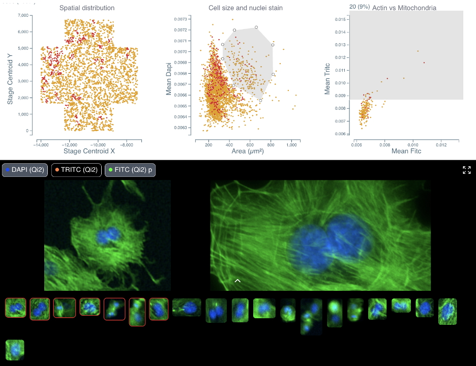

# Automation of spatial single-cell analysis with Cytely
**Karl Johansson, Johannes Kumra Ahnlinde, Oscar André, Philip Nordenfelt, Pontus Nordenfelt**
Cytely AB, Medicon Village, Lund, Sweden

## Specific Focus and scientific questions asked
Traditional microscopy excels at capturing subcellular structures but typically falls short in providing comprehensive population-level context, which is crucial to understanding cellular heterogeneity and rare cellular events. Conventional high-resolution imaging approaches tend to focus on a limited number of cells, thereby introducing potential biases and limiting statistical power. Conversely, high-content screening often compromises spatial resolution, making it reducing the ability to discern subcellular phenotypes. The central challenge addressed by Cytely is how to efficiently automate microscopy workflows to integrate high-resolution, single-cell spatial context with broad, population-level insights, enabling unbiased and reproducible analysis of diverse cellular phenotypes, particularly rare and dynamic events.

## Key findings and innovations
Cytely is based on the scientific foundation coming from the Nordenfelt Lab {cite:p}`Andr2023`, leveraging principles from data-driven microscopy (DDM) to significantly enhance accuracy and throughput in spatial single-cell analysis. The platform integrates whole populations overview and data at a single-cell level, allowing for rapid, unbiased identification of cellular phenotypes (Fig. 1). Cytely effectively characterizes thousands of cells based on features such as cell morphology, fluorescence intensity, and subcellular organization. This approach facilitates the precise selection and revisiting of cells of interest, allowing in a second step for high-resolution spatial imaging of rare or phenotypically distinct cellular subsets (Fig. 2).


:::{div} figure-like


Fig. 1: **Cytely's standard browser GUI.** The mitotic cell subpopulation of a HeLa cell sample is displayed ([link to dataset](https://app.cytely.io/essential/81438ed6-48ee-412a-a2c5-03551edcad0c/results/shared)).
:::

:::{div} figure-like



Fig. 2: **Side by side comparison of initial low-resolution image and curated high-resolution re-imaging of the same cell.** The dataset consists of bovine pulmonary artery endothelial cells ([link to dataset](https://app.cytely.io/essential/5eb05c11-9fd6-4304-a2d2-4e4f8e323a61/results/shared)).
:::

In experiments investigating cellular phagocytosis, Cytely demonstrated its unique ability to visualize the spatial localization of engulfed particles within individual cells, identifying heterogeneity in uptake rates that traditional bulk analyses missed. Similarly, Cytely's approach enabled automated detection and characterization of cellular events, such as cell division or apoptosis, and allowed for curation of such data through high-resolution re-imaging at a  significantly higher rate and accuracy compared to conventional microscopy.

## Methodology and implementation details
Cytely is implemented as a microscopy-based, hardware-agnostic platform compatible with various imaging systems equipped with motorized stages. The workflow begins with a low-resolution, population-level image acquisition phase that rapidly segments and extracts morphological and intensity-based cellular features. The software leverages classical segmentation approaches combined with advanced AI algorithms to robustly characterize cellular phenotypes in real-time, enabling immediate identification of target cell populations.
Once specific cellular subsets are identified, Cytely triggers high-resolution spatial imaging, automatically directing microscopy resources to acquire detailed, single-cell data. The entire workflow, from image acquisition to analysis and data documentation, is managed within an intuitive, integrated software interface, eliminating the need for complex scripting or manual intervention.
Image analysis is performed using defined schemas, allowing for easy replication and all datasets are stored centrally and can be shared both internally and externally, facilitating data transparency ([example of shared dataset](https://app.cytely.io/essential/c4a8fe20-e879-47db-b202-e790c0e5fb14/results/shared)). 


## Contributions to interoperability
Cytely's platform is completely hardware agnostic and is designed to integrate seamlessly with widely used microscopy systems. The modular and flexible nature of Cytely's analysis pipeline enables straightforward adaptation to diverse experimental setups and research needs. Its compatibility with open standards and extensive device support promotes broad community adoption and facilitates integration into existing laboratory workflows.

## Limitations
While Cytely robustly handles standard microscopy scenarios, particularly challenging tissues with complex segmentation requirements may still present difficulties. Additionally, the system currently relies on user-driven parameter tuning prior to experiments to optimize analysis outcomes, particularly in contexts with significant biological variability. Future iterations aim to implement adaptive parameter tuning algorithms to minimize manual intervention further and enhance the usability and reproducibility of experiments.

----

```{bibliography}
:style: plain
:filter: docname in docnames
```