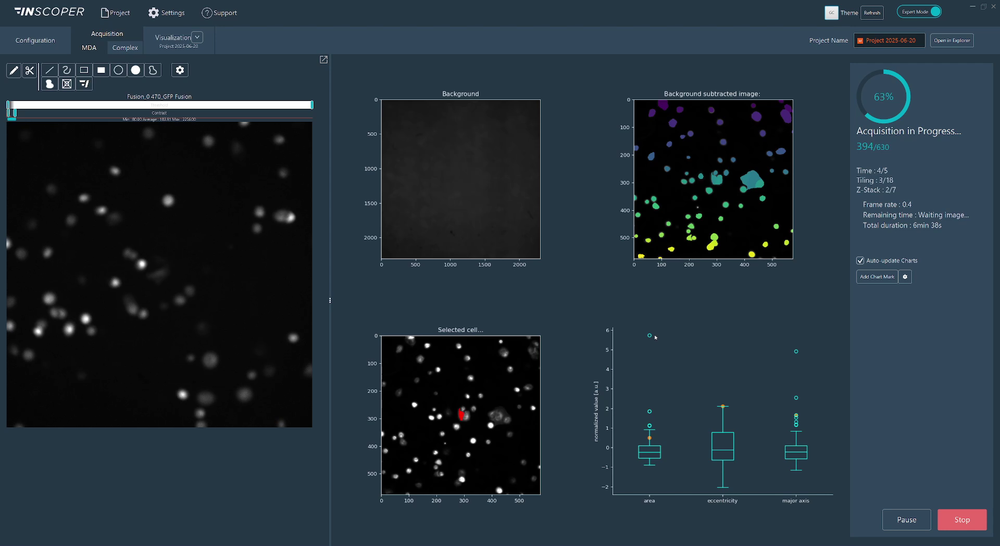

# Inscoper
**Claire Demeautis, Célia Martin, Rémy Torro, Thomas Guilbert, Otmane Bouchareb**
INSCOPER SAS, Cesson-Sévigné, France

## Approaches to smart microscopy

Smart microscopy stands at the forefront of our R&D initiatives, with innovative applications continually emerging. In this context, we introduce two of our advanced solutions, each designed to address specific application requirements: the **Roboscope**, optimized for the detection of rare cellular events, leveraging sequence interruption, and the **Python script call module**, seamlessly incorporated within our image acquisition software.

### 1. Roboscope: methodology, implementation details

Our approach focuses on developing an innovative software solution to make microscopes smarter and more autonomous. The software combines light microscopy experiment acquisitions, advanced analysis algorithms, sequence interruption and deep learning integration to enable custom event-driven acquisition. The system is adaptable to various experimental workflows, enabling the capture of transient events while minimizing data consumption.

We designed an automation technique capable of interrupting a main sequence to start a new one, based on the outcome of an image analysis workflow over the image stream. The new sequence may also be interrupted, repeating this pattern as needed. The Roboscope is able to  screen a sample at low magnification looking for an *Event Of Interest* (EOI, *i.e.* mitosis here). Upon detection of such an EOI by the image analysis workflow, the main screening sequence is interrupted and a new sequence at higher magnification takes over, using parameters returned by the image analysis workflow. This solution requires an Inscoper device controller, the Inscoper Imaging Software and a CPU. A graphical processing unit (GPU) is recommended to increase the computation speed in deep learning applications but not required. While the device controller runs the sequence, the images are analysed through the CPU and GPU. As soon as an EOI is detected, the running sequence is interrupted, new acquisition parameters are calculated and sent to the device controller.

Users can design workflows for their specific applications, defining the targeted event and the consequential actions. The workflow is set up graphically  via an ergonomic user interface (Figure 1). Theoretically, new model training takes less than 30 minutes on a Nvidia GeForce RTX 2080Ti GPU.

:::{div} figure-like


Fig. 1: **Roboscope GUI**
:::

The key innovation of our development is the interruption sequence during a sequence. With this method, the user doesn't miss an interesting event.
The main features of our approach are : 
- **Adaptable**, with a modular software architecture that allows the EOI detection to be modified according to the user’s needs. A novel network embedding, sGAN, can be fine-tuned to a wide range of biological applications. Users can also trigger their own Python scripts, custom-made for their applications of interest.
- **Easy to use**, without coding skills on a graphical interface, to retrain the models.
- **Fast**, with optimised microscope control and sequence interruption, dedicated modules running in parallel.
- **Parsimonious**, by limiting photobleaching and phototoxicity and only sending qualified events to the computer. This considerably reduces the amount of data generated and saved.

### 2. Python script call module:  methodology, implementation details

Within the Inscoper Imaging Software (IIS), we have developed a module that allows users to integrate custom Python scripts to perform smart microscopy tasks. This module, incorporated into our Multidimensional Acquisition (MDA) sequence builder, is triggered upon image reception. It enables adaptive-feedback microscopy: real-time adjustments to device parameters based on outcomes from image analysis. Additionally, it enables users to write metadata about the image content and dynamically display informative visualizations during acquisitions.

:::{div} figure-like



Fig. 2: **Real-time visualizations from a Python script in IIS**
:::

As part of the IIS framework, we bundle a Python distribution pre-installed with commonly used libraries for image analysis. We enable users to switch to their system python installation or one of their custom environments so that they can use the libraries they are familiar with and benefit from any hardware-specific installation, such as GPU-optimized libraries. To streamline the scripting process, we provide a utility library that simplifies conversions between image space and hardware space (for instance, converting pixel displacement into lateral X and Y stage displacements), writing custom image metadata, and transmitting figures (generated using ``matplotlib``, ``seaborn``, or ``plotly``) directly into the IIS interface.

Code-wise, users define two functions:
- Image-provider function: Uses metadata from the most recently received image to check the current acquisition context and select images requiring processing. Typically, this selection may be empty in scenarios such as mid-stack Z-plane captures or initial channel acquisitions within a multi-channel sequence, effectively preventing unnecessary computations.
- Processing function: Accepts the image selection identified by the image-provider function and performs analytical operations. The outputs from this function can include:
    - Updated device parameters for adaptive feedback
    - Quantitative image metadata entries
    - Saved files (e.g., cropped images, segmentation masks, image reconstructions)
    - Real-time visualizations displayed within IIS (dashboard-like)
    - Any combination of the above

Graphically, users import their custom Python script (``.py`` file) into the Python script module and associate the defined image-provider and processing functions. Initially, all function arguments and outputs are explicitly matched by type and value. Users can subsequently save presets, retaining only adjustable arguments that are not tied to specific hardware parameters.


## Contributions that could contribute to interoperability
Our acquisition solution includes a device controller and software that is compatible with almost all camera-based microscope setups and all their associated devices on the market ([supported device list](https://www.inscoper.com/supported-devices/)).
Also, using the agnostic [useq-schema](https://pymmcore-plus.github.io/useq-schema/) to describe the main sequence and its various dependencies is easy to implement in our Inscoper’s Roboscope.
Finally, Inscoper is thinking about its acquisition workflows and machine learning training in terms of open source availability, with the aim of forming a community ready to exchange, share and populate a database enabling each user to lift their technological barriers.

#### Current bottlenecks, Roadmap
We want to apply our approach to more biological applications and systems. We will soon integrate a new microscopy modality (photomanipulation) into smart microscopy. 

### Python script call module

Within the Inscoper Imaging Software (IIS), we have developed a dedicated module that allows users to integrate custom Python scripts to perform smart microscopy tasks. This module, incorporated into our Multidimensional Acquisition (MDA) sequence builder, is triggered upon image reception. It enables adaptive-feedback microscopy: real-time adjustments to device parameters based on outcomes from image analysis. Additionally, it enables users to write metadata about the image content and dynamically display informative visualizations during acquisitions. 

#### Methodology, Implementation details

As part of the IIS framework, we bundle a Python distribution pre-installed with commonly used libraries for image analysis. We enable users to switch to their system python installation or one of their custom environments so that they can use the libraries they are familiar with and benefit from any hardware-specific installation, such as GPU-optimized libraries. To streamline the scripting process, we provide a utility library that simplifies conversions between image space and hardware space (for instance, converting pixel displacement into lateral X and Y stage displacements), writing custom image metadata, and transmitting figures (generated using matplotlib, seaborn, or plotly) directly into the IIS interface.

Code-wise, users define two functions:
* **Image-provider function**: Uses metadata from the most recently received image to check the current the acquisition context and select images requiring processing. Typically, this selection may be empty in scenarios such as mid-stack Z-plane captures or initial channel acquisitions within a multi-channel sequence, effectively preventing unnecessary computations.
* **Processing function**: Accepts the image selection identified by the image-provider function and performs analytical operations. The outputs from this function can include:
    - Updated device parameters for adaptive feedback
    - Quantitative image metadata entries
    - Saved files (e.g., cropped images, segmentation masks, image reconstructions)
    - Real-time visualizations displayed within IIS (dashboard-like)
    - Any combination thereof

Graphically, users import their custom Python script (*.py* file) into the Python script module and associate the defined image-provider and processing functions. Initially, all function arguments and outputs are explicitly matched by type and value. Users can subsequently save presets, retaining only adjustable arguments that are not tied to specific hardware parameters.

## Contributions that could contribute to interoperability

Our acquisition system includes a device controller and software compatible with nearly all camera-based microscope setups and associated devices ([supported device list](https://www.inscoper.com/supported-devices/)).

We are actively rolling out support for the [useq-schema](https://pymmcore-plus.github.io/useq-schema/) standard to describe acquisition sequences, promoting greater interoperability.

The Roboscope enables users to retrain a versatile classification model with a GUI, following a no-code approach. Our custom Python scripting approach offers a flexible yet structured framework, welcoming users with a minimum of training. While Python coding and image analysis expertise is essential for developing new applications, our utility library provides pre-built scripting blocks that less experienced users can adapt to their needs. 


## Current bottlenecks, Roadmap

Real-time device updates currently affect acquisition performance, creating limitations for certain optimizations with our Inscoper hardware. In general, fully unrestricted adaptive microscopy—where every device parameter can be adjusted at any time—may lead to suboptimal system efficiency. To mitigate this, pre-defining which devices and acquisition structures are modifiable helps maintain performance and stability. The Roboscope addresses this challenge by pre-configuring successive acquisition sequences tailored to specific applications. 

We aim to enhance virtual device simulations to better replicate real-world acquisition and smart microscopy scenarios. For example, a virtual camera could simulate image acquisition by cropping from a larger mosaic image, where adjustments to X and Y parameters effectively shift the crop region, emulating believable microscopy interactions.

We want to apply our approaches to more biological applications and systems. We will soon integrate a new microscopy modality (photomanipulation) into our smart microscopy products. 

----

```{bibliography}
:style: plain
:filter: docname in docnames
```