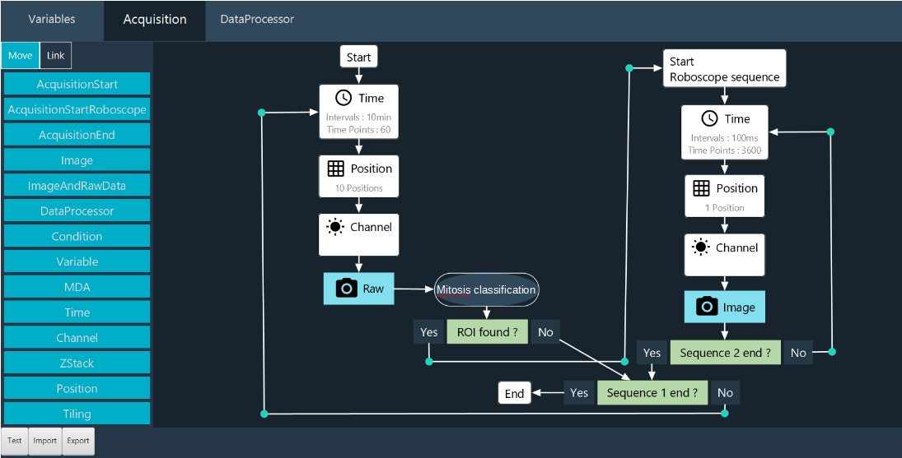

# Inscoper's Roboscope
**Claire Demeautis, Célia Martin, Rémy Torro, Thomas Guilbert, Otmane Bouchareb**
INSCOPER SAS, Cesson-Sévigné, France

## Approach to smart microscopy
Our approach focuses on developing an innovative software solution to make microscopes smarter and more autonomous. The software combines light microscopy experiment acquisitions, advanced analysis algorithms, sequence interruption and deep learning integration to enable custom event-driven acquisition. The system is adaptable to various experimental workflows, enabling the capture of transient events while minimizing data consumption.

## Methodology, Implementation details
We designed an automation technique capable of interrupting a main sequence to start a new one, based on the outcome of an image analysis workflow over the image stream. The new sequence may also be interrupted, repeating this pattern as needed. Exemplary, the Roboscope is able to  screen a sample at low magnification looking for an Event Of Interest (EOI, ie. Mitosis here). Upon detection of such an EOI by the image analysis workflow, the main screening sequence is interrupted and a new sequence at higher magnification takes over, using parameters returned by the image analysis workflow. This solution requires an Inscoper device controller, the Inscoper Imaging Suite and a CPU. A graphical processing unit (GPU) is recommended to increase the computation speed in deep learning applications but not required. While the device controller runs the sequence, the images are analysed through the CPU and GPU. As soon as an EOI is detected, the running sequence is interrupted, new acquisition parameters are calculated and sent to the device controller.
Users can design workflows for their specific applications, defining the targeted event and the consequential actions. The workflow is set up graphically via an ergonomic user interface (Fig. 1). Theoretically, new model training takes less than 30 minutes on a Nvidia GeForce RTX 2080Ti GPU.

:::{div} figure-like



Fig. 1: **Roboscope GUI**
:::

## Key features and innovations
The key innovation of our development is the interruption sequence during a sequence. With this method, the user doesn't miss an interesting event.
The main features of our approach are : 
- **Adaptable**, with a modular software architecture that allows the EOI detection to be modified according to the user’s needs. A novel network embedding, sGAN, can be fine-tuned to a wide range of biological applications. Users can also trigger their own Python scripts, custom-made for their applications of interest.
- **Easy to use**, without coding skills on a graphical interface, to retrain the models.
- **Fast**, with optimised microscope control and sequence interruption, dedicated modules running in parallel.
- **Parsimonious**, by limiting photobleaching and phototoxicity and only sending qualified events to the computer. This considerably reduces the amount of data generated and saved.

## Contributions that could contribute to interoperability
Our acquisition solution includes a device controller and software that is compatible with almost all camera-based microscope setups and all their associated devices on the market ([supported device list](https://www.inscoper.com/supported-devices/)).
Also, using the agnostic [useq-schema](https://pymmcore-plus.github.io/useq-schema/) to describe the main sequence and its various dependencies is easy to implement in our Inscoper’s Roboscope.
Finally, Inscoper is thinking about its acquisition workflows and machine learning training in terms of open source availability, with the aim of forming a community ready to exchange, share and populate a database enabling each user to lift their technological barriers.

## Current bottlenecks, Roadmap
We want to apply our approach to more biological applications and systems. We will soon integrate a new microscopy modality (photomanipulation) into smart microscopy. 

----

```{bibliography}
:style: plain
:filter: docname in docnames
```