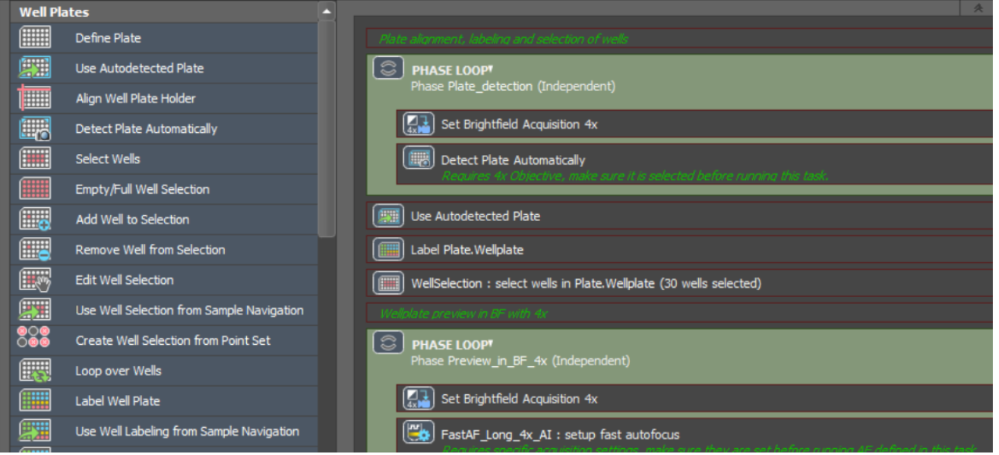
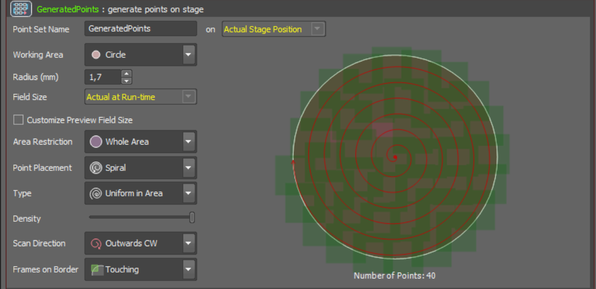
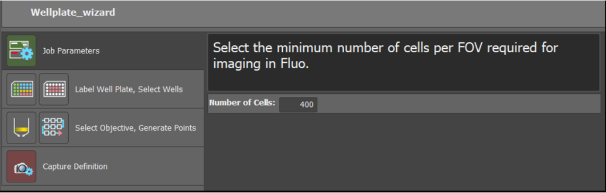
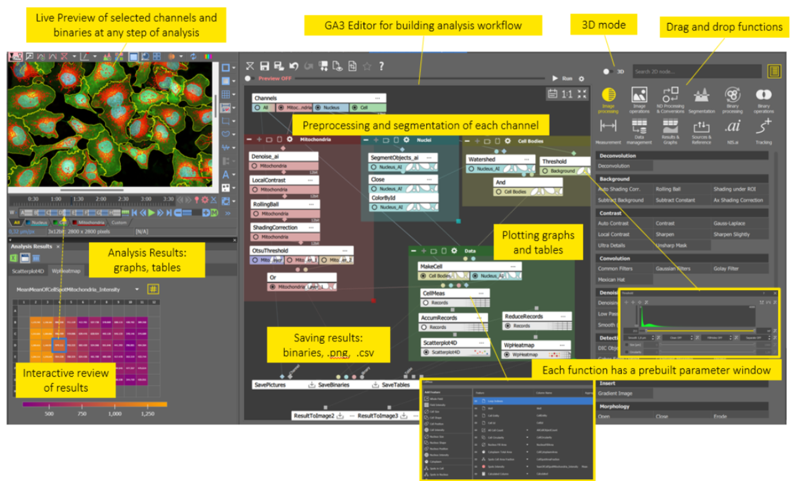
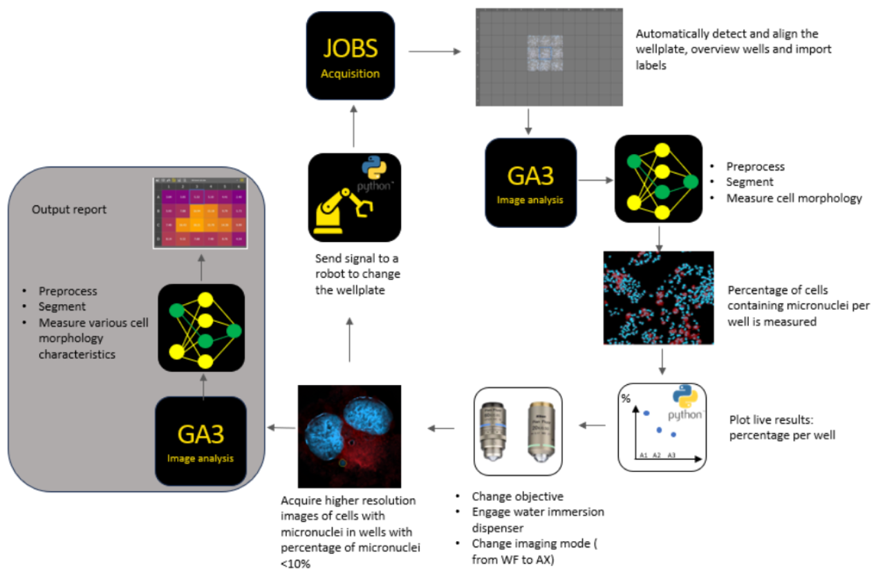

# Visual programming for Smart Microscopy with NIS-Elements (Nikon)
**Nelda Antonovaite, Andrii Rogov**, Nikon Europe B.V.

## Approach to smart microscopy
NIS-Elements is a comprehensive software platform designed for all Nikon microscopes, supporting a wide array of imaging modalities such as upright and inverted widefield, confocal (AX and NSPARC), multiphoton, STORM, and SIM. Beyond Nikon hardware, NIS-Elements allows seamless integration with numerous third-party devices, including spinning-disks, deepSIM modules, cameras, light sources, stages, and modular illumination devices such as photostimulation, TIRF, and FRAP. Additionally, the software natively supports NI DAQ boards, enabling low-latency control of almost any external device. With the release of NIS-Elements version 6.10, a Python package was introduced, further expanding device control capabilities and workflow customization. 

This extensive compatibility empowers users to perform sophisticated experiments, including advanced feedback microscopy. In addition to robust device control, developers of feedback microscopy require software that is flexible enough to enable customized and automated acquisition workflows, as well as the integration of real-time, on-the-fly analysis. NIS-Elements addresses these requirements by allowing full automation of decision-making in complex experiments, reducing human error and bias, increasing throughput, and freeing microscopists from repetitive tasks. 

Within NIS-Elements, the JOBS module enables users to create custom acquisition workflows that incorporate on-the-fly analysis through the General Analysis module (GA3). JOBS utilizes a visual programming interface, where users can drag and drop various tasks into a sequence.These tasks come with prebuilt parameter options and support advanced features like loops, phases, and wizards. This approach ensures that every step of the acquisition process can be fully customized and automated, with analysis results dynamically guiding subsequent acquisition steps. 

The advanced GA3 image analysis module also employs visual programming, with a key distinction: its interconnected, branched architecture is designed to handle multiple channels, binary masks, measurement results, and graphs in parallel, rather than in a simple sequential order.  GA3 leverages the full suite of image processing tools in NIS-Elements, including AI-based denoising, deblurring, deconvolution, and user-trained deep learning models for segmentation and signal-to-noise ratio enhancement (`NIS.ai` module), all of which can improve the speed and quality of analysis. 

Both JOBS and GA3 are designed to be intuitive, allowing users to create sophisticated acquisition and analysis workflows with minimal training. They offer substantial flexibility, supporting tasks such as wellplate and slide scanning, multi-pass acquisitions (e.g., low magnification followed by high magnification, or combinations of widefield and confocal imaging), conditional imaging (e.g., stopping when a certain number of cells are imaged or when rare events are detected), and tracking. 

For advanced applications, Python scripting is available both within JOBS (for external device control) and GA3 (for open-source analysis tools, e.g., CellPose-SAM). Together, NIS-Elements with JOBS and GA3 bridges the gap between limited, easy-to-use preconfigured software and complex, highly flexible scripting-based solutions. 

## Implementation and key features
### JOBS module
The JOBS editor features an intuitive graphical interface that is easy to learn and requires no programming experience. Users can drag and drop over 180 available tasks to create custom image acquisition workflows (see Figure 1 and Video 1). These tasks include: 

- Defining and manipulating wellplates and scanning areas for various types of holders 

- Creating imaging loops, phases, and conditional branches (if/else) 

- Setting acquisition parameters such as objective, channels, timelapses, Z-stacks, triggering, image capture, and saving 

- Defining focusing procedures 

- Performing on-the-fly image analysis and interactive functions, such as prompting the user with questions 

- Device control, Python scripting, macros, and more 

Each JOBS function also has a panel where optional parameters can be selected (see Figure 2 and Video 1). Furthermore, software commands are recorded in Command History and can be used as macro commands. You can edit or extend them using macro command library. If any specific software function for device control or handling of images is not available within JOBS editor, it can be included as a macro command. Similarly, Python editor allows to control devices that are not integrated within the NIS-Elements software or NI DAQ board. Once a JOBS workflow is created, a wizard interface can be configured by simply marking JOBS tasks that should be added to the wizard. Additional descriptions, remarks, recommendations or even images can be added to explain to the user the purpose of the settings and guide through the selection. When launched, the user only needs to select variables that fit their experiment (see Figure 3 and Video 2). This way, even less experienced users can run complicated imaging experiments.

Finally, JOBS execution can be monitored by showing captured images as well as plotting analysis results (see Video 2). Additional interactions can be set up to ask the user to make the decision on the go or make the decision automatically based on conditions or analysis results.

### General Analysis module (GA3)
Similar to JOBS, GA3 uses a visual programming approach, where prebuilt image analysis functions—covering processing, segmentation, measurement, data handling, and more—can be dragged and dropped into a dynamically connected analysis sequence (see Figure 4). GA3 offers over 400 functions, organized into twelve categories, with tools available for both 2D and 3D data: 

- Image Processing 
- Image Operations 
- Multi-Dimensional Processing & Conversions 
- Segmentation 
- Binary Processing 
- Binary Operations 
- Measurement 
- Data Management 
- Results & Graphs 
- Sources & Reference 
- `NIS.ai` 

If a specific function is missing or if an open-source tool is required, the GA3 Python editor provides further extensibility. 

Analyses can be previewed live on selected regions of interest, allowing users to inspect and quickly adjust settings while building workflows. The interactive graphs and tables make it easy to explore analysis data in relation to the image and generated binaries. 

Any GA3 workflow can be incorporated into a JOBS workflow, using the captured image as input and producing outputs such as tables (with points, regions, wells, etc.) or binary masks. These outputs can then be used within JOBS to drive decisions based on analysis results (see examples in Figure 5 and Video 3). 

## Current bottlenecks and roadmap 
A primary limitation is the speed of image analysis for very large datasets. This can be improved through the use of more powerful computers, development of GPU implementations for computationally intensive tasks and ensuring that only relevant data - excluding empty frames - is being acquired. Additionally, parallel computing solutions are being explored. While GA3 and JOBS are designed for usability, there remains a learning curve, so additional improvements are planned to streamline workflow creation. Importantly, the integration of Python in both GA3 and JOBS has opened the door to utilizing open-source Python packages and community-developed resources—a direction that continues to be actively developed. 

## Figures and video screencasts 
:::{div} figure-like

Figure 1. **JOBS editor.** Acquisition and analysis functions can be dragged into the sequence to create a custom acquisition workflow for feedback microscopy.
:::

:::{div} figure-like

Figure 2. **Example of optional parameters for „generate points“ function within JOBS editor.**
:::

:::{div} figure-like

Figure 3. **JOBS workflow can be converted into a simple wizard enabling users that are not experienced with microscopy, device control and image analysis, to run feedback microscopy experiments.**
:::

:::{div} figure-like

Figure 4. **GA3 editor is a visual programming-based interface where completely customized image analysis workflows can be created and then integrated into JOBS editor enabling feedback microscopy experiments within NIS-Elements.**
:::

:::{div} figure-like

Figure 5. **Example of the feedback microscopy experiment workflow within NIS-Elements software using JOBS and GA3 modules.**
:::

Video 1 : [Simple Wellplate acquisition](https://youtu.be/33tWSQ_-luQ)

Video 2 : [Target Cell Count Python Plot](https://youtu.be/vDSK1nE8fok)

Video 3: [Automated Feedback Microscopy](https://youtu.be/mKebRqE7rUk)

## Documentation and references 
1. A lot of information about the use of GA3, JOBS and other preprocessing tools (deconvolution, `NIS.ai`) are included in the NIS-Elements help files. Some examples are also included.

2. A GitHub page is available that include JOBS, GA3 and Python examples: 
   - [JOBs examples](https://github.com/Laboratory-Imaging/JOBS-examples) 
   - [GA3 and Python examples](https://github.com/Laboratory-Imaging/GA3-examples)

3. NIS-Elements tutorials are continuously being updated on Nikon’s e-learning platform which is available to all Nikon customers by submitting a request at [Nikon e-learning](https://www.microscope.healthcare.nikon.com/en_EU/resources/e-learning#e-learning-signup) 

4. Some examples of publications that have implemented feedback microscopy are listed below: 
   -  [High-Throughput Microenvironment Microarray (MEMA) High-Resolution Imaging | SpringerLink](https://link.springer.com/protocol/10.1007/978-1-0716-1811-0_4)
   -  [Data-driven microscopy allows for automated context-specific acquisition of high-fidelity image data: Cell Reports Methods](https://www.cell.com/cell-reports-methods/fulltext/S2667-2375(23)00030-9?uuid=uuid%3Afb81aa22-2014-4674-b2c7-98969dc7bf7d)
   -  [Robotic data acquisition with deep learning enables cell image–based prediction of transcriptomic phenotypes](https://www.pnas.org/doi/epub/10.1073/pnas.2210283120)

5. Other Nikon resources can be found here: Resources | Nikon Europe B.V., including application notes featuring feedback microscopy: 
   - [High content screening lifetime data_ A feedback mic Exp WF ](https://downloads.microscope.healthcare.nikon.com/phase7/literature/Application-Notes/20250227_High-content-screening-lifetime-data_-A-feedback-mic-Exp-WF.pdf)
   - [Feedback microscopy using Nikon AX confocal microscopy and JOBS software to bridge mm to µm structures ](https://downloads.microscope.healthcare.nikon.com/phase7/literature/Application-Notes/2416E_Feedback_microscopy_using_Nikon_AX_confocal_microscopy_and_JOBS_software_to_bridge_mm_to_%C2%B5m_structures.pdf)
