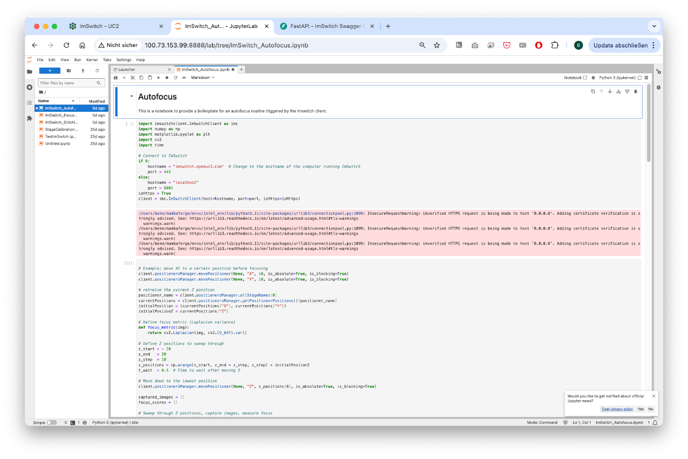

# ImSwitch for openUC2
**Benedict Diederich**, openUC2 GmbH

# Specific Focus and Scientific Questions Asked

openUC2 integrates modular microscopy with advanced automation to explore dynamic cellular behaviors and visualize individual fluorescent objects or scan large microscopic objects, ideally making these capabilities universally accessible. Our primary goal is to support researchers who lack access to cutting-edge microscopy technology, enabling them to conduct sophisticated experiments across diverse fields, including virology and all areas of education. Leveraging Arkitekt’s integration, we aim to standardize microscopy control workflows, simplifying the setup and execution of complex imaging experiments that may also include auxiliary hardware such as robot arms or pipetting robots.

We are developing a versatile platform that encompasses a broad array of tools suitable for smart experimental designs, particularly those that require more than a single image capture and benefit from combining various modules to conduct intricate experimental protocols. Our main focus lies on live-cell imaging, such as characterizing bacterial responses to bacteriophage exposure under different environmental conditions. Through this approach, we aim to systematically analyze effects related to temporal dynamics, spatial positioning, and morphological changes. Ultimately, our platform seeks to significantly lower the entry barrier for advanced microscopy experiments, democratizing access and fostering broader participation within the scientific community. This we do by providing parts that feature a lower price tag and increased simplicity by making different parts compatible with each other using the openUC2 cube-like toolbox. With this openUC2 aim to **become the Raspberry Pi for optics**.

:::{div} figure-like

Fig. 1: **Standard GUI from openUC2's ImSwitch in the browser**
:::

# Key Findings and Innovations

openUC2 cubes controlled through ImSwitch combined with Arkitekt provide modular, scalable microscopy setups that dynamically respond to smart events in multiscale microscopy. We took great care to make these experiments as reproducible as possible and ensure a platform independent operation. For this, we created Docker containers for the different apps such as microsocopy control, image processing and hardware interaction, while drivers for hardware control are embedded. This ensures reproducibility and standardization of microscopy environments across diverse research setups, ensuring consistent and reliable outcomes - independent from the underlying Python environment. Integration with Opentrons robots and robotic arms further expands automation beyond imaging, facilitating comprehensive experimental workflows including sample preparation, reagent addition, and plate handling. The modular nature of openUC2 significantly simplifies setup complexity, enhancing throughput and reproducibility in smart microscopy experiments.

:::{div} figure-like

Fig. 2: **Different Apps in form of controllers enable more complex experiments including the visual graphical interface**
:::

The operational model splits into educational and professional aspects. Educational initiatives include introductory Jupyter Notebooks and workshops designed to teach students how to build smart microscopes, capturing their first images and developing fundamental algorithms such as autofocus. Knowledge gained in educational settings is directly transferable to professional equipment, ensuring consistency as the software and hardware platforms remain uniform across both educational and professional contexts. Jupyter notebooks have full access to the hardware and can include any external python library. It can run on the same hardware as the microscopy server (e.g. Raspberry Pi) that also drives the hardware or on a remote cluster HPC if more computational power is desired.

:::{div} figure-like

Fig. 3: **A Jupyter Notebook Server can offer the creation of simple smart microscopy workflows by using common image processing pipelines and direct in-browser visualisation**
:::

# Methodology and Implementation Details

openUC2 microscopes rely on the already well established ImSwitch microscopy control software that was implemented in Python. We have ensured that the Model-Viewer-Presenter scheme of the underlying architecture fully avoids the use of QT component to make it more lightweight and operatable through the web. This also makes the use inside docker container a lot easier since information can be transported through TCP/UDP packages. In collaboration with developers from the Forklift framework, we have developed a dedicated operating system based on Raspberry Pi OS, embedding all necessary drivers and software components directly onto a flashable SD card. The compilation process is fully automated through GitHub Actions, enhancing maintainability and portability.

A dedicated workflowmanager inside ImSwitch can formulated complex workflows as a list of tasks, while they are first formulated and compiled into hardware instructions before they are carried out on the hardware itself. The tasks can be provided by a python dictionary of hardware (e.g. capture image, move stage) or software events (e.g. triggers, waits, image processing results) or by a list that is uploaded via the REST API.

:::{div} figure-like

Fig. 4: **An example how a workflow in ImSwitch can be formulated. Every stp has a pre and post function that is exucted. The graph is build up first, before the instructions are executed in a timely manner**
:::

One example to formulate this list visually is blockly. It creates a JSON object with all the necessary steps that will be interpreted by the ImSwitch backend and executed on the hardware.

:::{div} figure-like

Fig. 5: **Blokly converts the different steps into a json object that is then later interpreted by the Workflowmanager**
:::

Our approach utilizes Docker containers for virtualizing software components, such as the imSwitch system, device drivers, and image processing tools. This significantly simplifies software management and ensures reproducibility across platforms. All device control commands are issued via REST APIs, signal updates are offered through a websocket connection. Instead of relying on the QT-based gui int he former ImSwitch variants, we have constructed a React-based web application that integrates seamlessly into the Arkitekt network, providing intuitive access to most available parameters and functions as defined services. Here, the microscope becomes a dedicated micro-service, that can for example offer the functionality of scanning a 2D area or vary the optical resolution by changing the objective lens. The dataflow inside Arkitekt enables image processing on dedicated hardware before a control command is back-channeled to the microscope to interact with the sample in a smart way. This not only includes microsocpes, but can be widened to include robots and alike.

:::{div} figure-like

Fig. 6: **The Arkitekt framework enables a simple way of creating complex workflows where multiple hard- and software components can be joined in a highly decentralized manner**
:::

Data flow management relies on a microservice architecture, where data accompanied by metadata is streamed from individual nodes to a central Arkitekt server node and subsequently distributed through lazy loading to processing or storage nodes. This abstraction layer ensures compatibility with common formats such as OME-Zarr or OME-TIFF, facilitating efficient data handling and interoperability.

# Contributions to Interoperability

openUC2 is entirely open source, committed to creating a highly interoperable ecosystem where diverse components seamlessly interact through standardized interfaces. In addition to that, we have created a firmware specifically designed for the ESP32 microocontroller. This firmware is designed to control various hardware components such as lasers, LEDs, motors, and galvo scanners using a unified codebase adaptable across multiple hardware configurations. This flexibility is further enhanced through CAN and I2C interfaces, facilitating the integration and control of external components. Low-level hardware control emphasizes human-readable interoperability through JSON-based dictionaries, which simplifies adding new parameters and functionalities. To facilitate rapid testing and interaction, we developed a web application leveraging WebSerial API, enabling immediate hardware access without additional installation. This setup supports straightforward experiments, such as browser-based time-lapse imaging using standard USB and UVC webcams, further emphasizing ease-of-use and accessibility.

:::{div} figure-like

Fig. 6: **To further lower the entry barrier to get starting with smart microscopy experiments, openUC2 offers the abbility to flash the firmware to the ESP32s using the openUC2 Flashing tool in the web**
:::

:::{div} figure-like

Fig. 6: **The Web-serial Standard enables the use of usb serial devices without the installation of additional software**
:::

A notable collaboration with FLIMLabs showcases this interoperability, where their open REST API was successfully integrated into the ImSwitch environment, enabling direct control and analysis of FLIM hardware. The combination of openUC2 and ImSwitch aims to foster an open ecosystem that allows extensive external interaction without restrictive agreements like NDAs.

:::{div} figure-like

Fig. 6: **An open REST API documented through the openapi swagger schema enables a fast interaction with the ImSwitch backend through the browser**
:::

# Limitations
The development of openUC2 in the professional software domain is still relatively early-stage, making the system potentially prone to errors. However, by developing a dedicated operating system for platforms such as Raspberry Pi or Jetson Nano, we significantly reduce such vulnerabilities, as all drivers and software components are thoroughly tested and continuously integrated through GitHub Actions. In case of issues, software versions can easily be reverted to stable builds, minimizing downtime.
Documentation remains incomplete, presenting challenges for new users integrating their interfaces with our software. We actively encourage community feedback and participation, providing resources through openUC2’s GitHub repository and forums to foster a collaborative environment for addressing questions and continuously improving our documentation.

Links:
- [Various scripts]()
- [Interfaces]()
- [Application]()
- [Developer Toolkit]()
