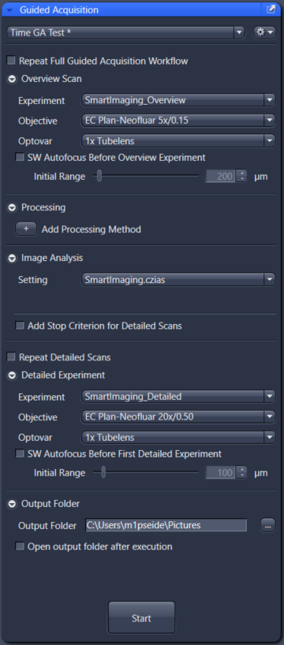
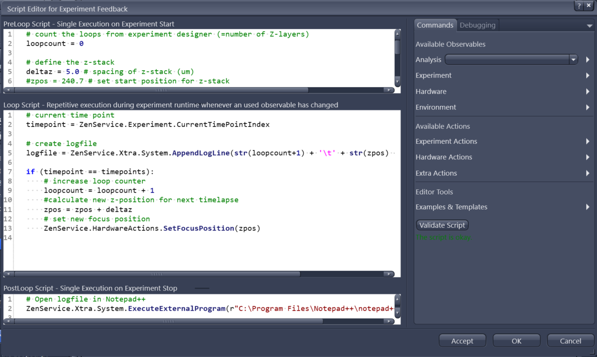
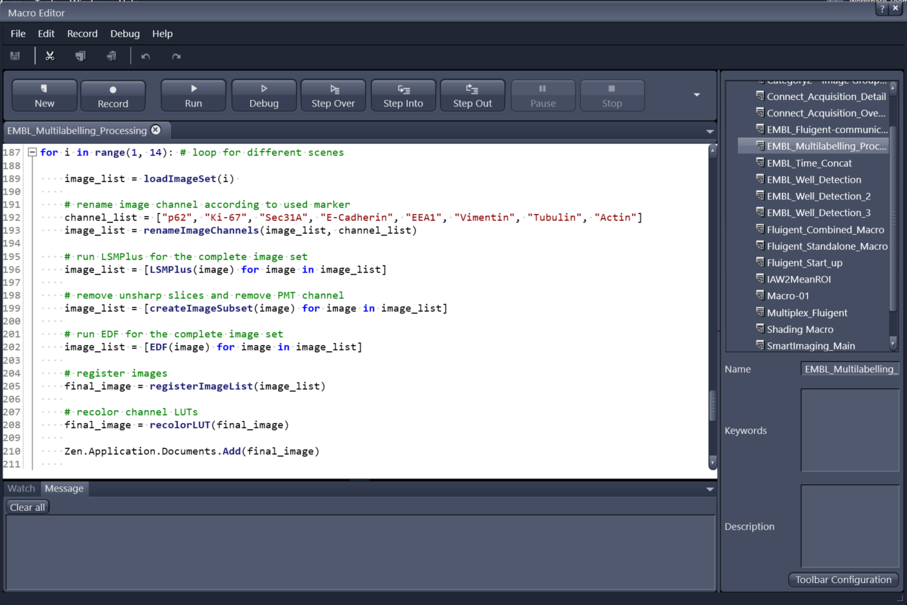

# Open Application Development (OAD) in Zeiss ZEN
**Philipp Seidel**, Carl Zeiss Microscopy GmbH

## Approaches to smart microscopy
The user base of ZEN is diverse both in terms of research / application focus and technical expertise. Hence, we aim at offering Smart Imaging interfaces at different levels of integration with ZEN’s main user interface. In the following sections I aim at illustrating these different tools and, their key features, their key applications, limitations and if available, references to further material.

### Guided Acquisition / Automated Photomanipulation

:::{div} figure-like

Fig. 1: **Guided Acquisition / Automated Photomanipulation**
:::

These GUI-based tools offer a simplified entry into typical Smart Imaging workflows addressing imaging novices and scientists without access to coding expertise. 

The **Guided Acquisition (GA)** user interface is shown in Fig. 1. It follows a fixed workflow, where an overview scan is followed by an image analysis block and several detailed scans. Positions (FOVs) of the detailed scans are derived from the image analysis. To keep the user interface simple, the user plugs in pre-configure experimental and image analysis settings for the three main steps. The user can furthermore add certain optional components, e.g. additional processing steps for the raw overview image, or manually adjust the number of detailed scans. Time-lapse acquisitions can be defined to allow for detection of sparse events.

GA builds modular on top of generic ZEN functionality like Acquisition Tab and Image Analysis Wizard. Besides simplifying usability, this comes with the benefit that other built-in features (like Deep Learning segmentations) also seamlessly work with GA. GA also is compatible with image data correlation via ZEN Connect, or high throughput well plate experiments.

Typical applications are high-resolution 3D imaging of sparse samples like embryos or organoids. Here, via Smart Imaging, the main workflow improvements are reduced data sizes and time-to-result. Follow the links at the end of this section for more details on such use cases.

Automated Photomanipulation follows a very similar approach. In a dedicated UI, the user assigns a pre-configured acquisition experiment and image analysis scheme. The notable difference is that instead of defining FOVs for subsequent high-resolution scans, the workflow defines image sub-regions that are subsequently bleached and tracked (by time-lapse acquisitions) to determine fluorescence recovery (FRAP) or similar read-outs. Besides, this tool could also serve simple opto-genetics experiments. 

Links:
- [Guided Acquisition OAD documentation](https://github.com/zeiss-microscopy/OAD/tree/master/Guided_Acquisition)
- [Guided Acquisition Webinar](https://www.zeiss.com/microscopy/en/resources/insights-hub/life-sciences/automate-your-experiments-with-image-analysis-and-guided-acquisition.html)
- [Smart Workflows with Celldiscoverer 7](https://www.zeiss.com/microscopy/en/resources/insights-hub/life-sciences/the-smart-microscope-for-automated-workflows-celldiscoverer-7-with-lsm-900.html)

### Experiment Feedback

:::{div} figure-like

Fig. 2: **Experiment Feedback**
:::

This is basically an advanced scripting tool directly integrated into a ZEN acquisition setup. It does require coding but is simpler to set up and in certain situations more powerful than OAD scripts.

The crucial feature of Experiment Feedback is the possibility to tune many experimental parameters “on-the-fly” during an ongoing acquisition. This includes parameters like exposure time, lamp intensity, time series intervals, objectives, stage positions and many more. It features (like GA) a pre-configured image analysis to measure sample parameters and automatically respond to them.

Some use cases become very easy to implement with Experiment Feedback, e.g. tracking objects during acquisition. Please find more examples in the linked Github page.

Links:
- https://github.com/zeiss-microscopy/OAD/tree/master/Experiment_Feedback
- [ZEN Developer Toolkit](https://www.zeiss.com/microscopy/en/products/software/zeiss-zen/zen-developer-toolkit.html)

### Macro Editor / Simple API / Object Model
:::{div} figure-like

Fig. 3: **Macro Editor**
:::

The main feature of OAD, as of today, is the scripting interface called “Simple API”. Most importantly, it comes with a small macro editor integrated in ZEN, and it offers interfaces for external applications written e.g. in Python (see links below for more details).

Internally, the Simple API uses IronPython, which is a C# implementation of Python with the purpose to serve .NET applications. Most noteworthy, this allows for implicit use of ZEN’s object model, hence, direct access to experimental setups, processing functions or czi image, and their respective methods. The macro editor is equipped with debugging, code-completion, recording (of a user’s interaction with ZEN) and documentation, simplifying onboarding and troubleshooting.

For external applications, COM and TCP-IP interfaces can be used. This allows tackling more complex use cases that requires a more refined code structure or additional libraries.

Simple API is most useful for integrating standard ZEN functionality into custom workflows for the purpose of process automation. Standard smart microscopy is covered by accessibility of basic HW functions like stage movements and objectives. However, it is not designed to change deeper acquisition parameters dynamically (like Experiment Feedback), and therefore has limitations for advanced smart imaging approaches.

Links:
- [Various scripts](https://github.com/zeiss-microscopy/OAD/tree/master/Scripts_IronPython2)
- [Interfaces](https://github.com/zeiss-microscopy/OAD/tree/master/Interfaces)
- [Application](https://github.com/zeiss-microscopy/OAD/tree/master/SmartMicroscopy/Detecting%20Mitosis)
- [Developer Toolkit](https://www.zeiss.com/microscopy/en/products/software/zeiss-zen/zen-developer-toolkit.html)
